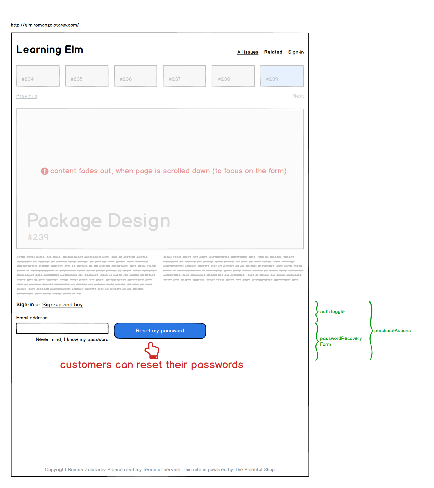

# Shopfront

Shopfront is a single page app.

## Model

A **shop** is the root entity of the app. It has:

- **name** &mdash; a few word string, e.g. `"Learning Elm"`,
- **theme** &mdash; custom CSS or just list of colors and typefaces,
- **footer** &mdash; an HTML template with links to static pages, e.g. Terms of Service,
- **keys** &mdash; secret API keys for Stripe, Amazon, Firebase,
- **currency** e.g. `"USD"`, `"EUR"`, all **prices** are displayed in this **currency**,
- **customers**, **issues**, and **purchases**.

**Issues** have:

- **title** &mdash; a string of few words
- **slug** &mdash; short unique string for URLs
- **cover** &mdash; an image
- **teaser** &mdash; HTML template
- **price** &mdash; in shop currency
- **body** &mdash; HTML template visible to purchasers

**Customers** can be authenticated by **email** and **password** e.g. via Firebase.

**Purchases** connect a **customer** with their **payments** and **issues**.

**Payments** have **time**, **currency**, **amount**, **Stripe reference**.

## How does it look

[View source](./shopfront/shopfront.bmpr) in [Balsamiq Mockups 3](https://balsamiq.com/products/mockups/) format.

## Page anatomy

- header
  - shopName
  - catalogFilters
    - showAllButton
    - showRelatedButton
  - authActions
    - signInButton
    - signOutButton
- issue
  - cover
  - name
  - slug
  - teaser
  - purchaseActions
    - signInForm
      - email
    - signUpForm
      - emailInput
      - passwordInput
      - cardNumberInput
      - expirationDateInput
      - cvcInput
      - buyButton

TDB...
